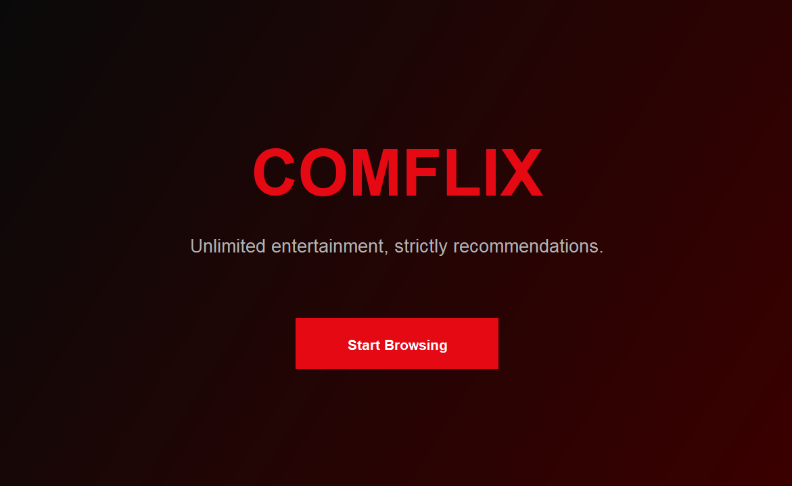
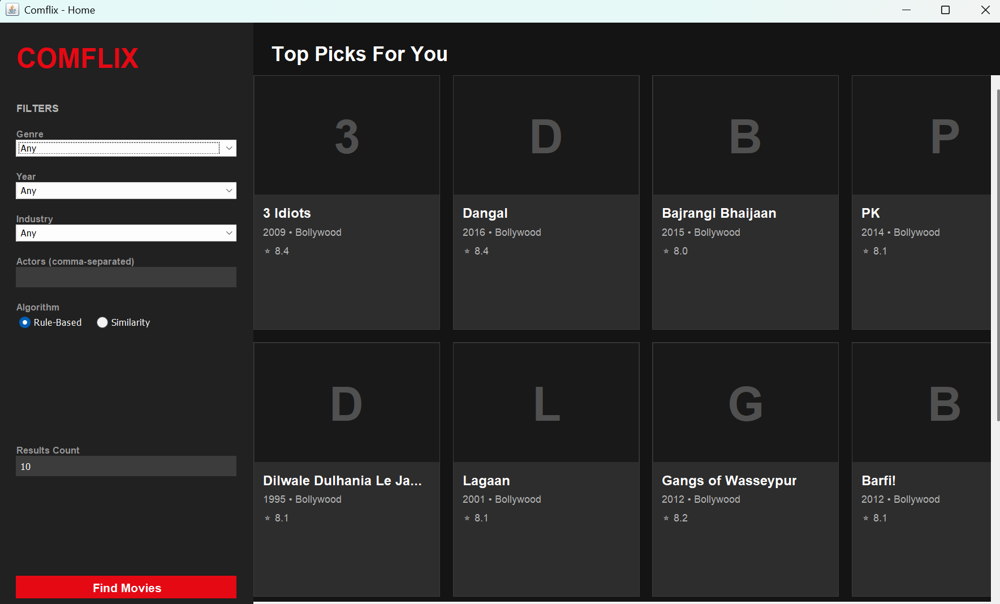
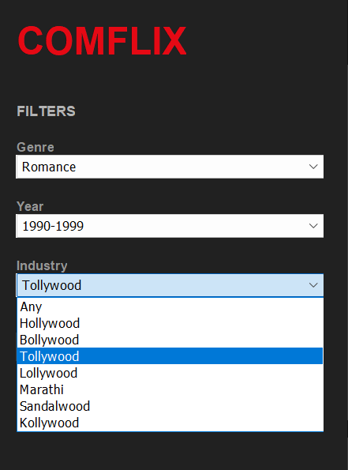
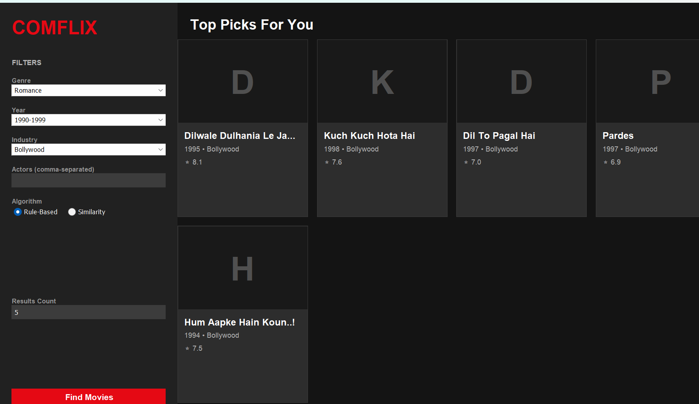
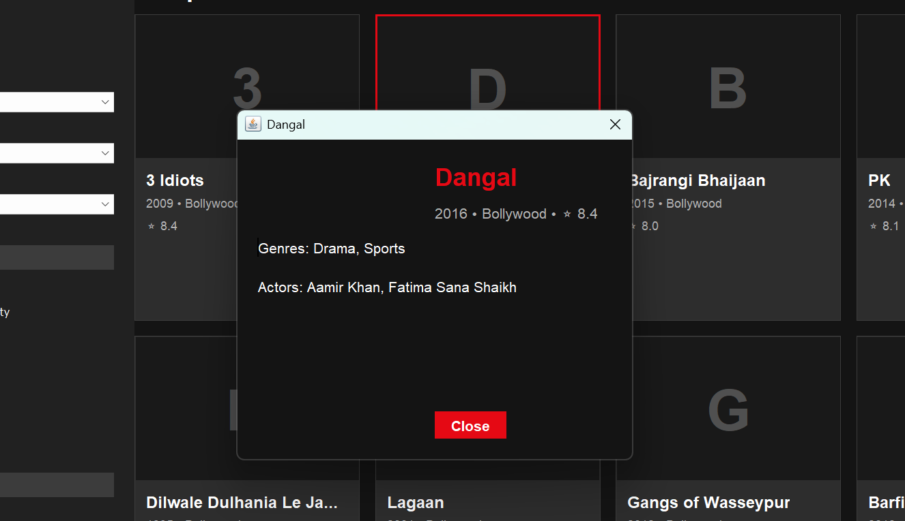

# Comflix 🎬

Comflix is a Java desktop movie recommendation system built using Java Swing and object-oriented programming principles. It provides an interactive GUI for browsing and filtering movies while supporting multiple recommendation algorithms through a clean, layered architecture.

---

## ✨ Features

- Modern desktop GUI built with Java Swing
- Welcome screen and main dashboard
- Movie recommendation system with two algorithms:
    - Rule-Based Recommendation
    - Similarity-Based Recommendation
- Dynamic filtering by:
    - Genre
    - Release year range
    - Actors
    - Industry
- Movie detail popup dialog
- Persistent movie dataset using Java serialization
- Clean and modular OOP-based design

---

## 🧠 OOP Concepts Used

This project demonstrates several important object-oriented programming concepts:

- **Abstraction** → Abstract `Media` class
- **Inheritance** → `Movie` extends `Media`
- **Encapsulation** → Private fields with getters/setters
- **Polymorphism** → `RecommendationAlgorithm` interface
- **Strategy Pattern** → Switchable recommendation algorithms at runtime
- **Deep Copying** → Used in model classes

---

## 🏗️ Project Architecture

Comflix follows a layered architecture:

- **UI Layer** → Java Swing GUI
- **Backend Layer** → Recommendation engine and algorithms
- **Domain Layer** → Core models like `Movie`, `User`, `Filters`
- **Data Layer** → Serialized dataset (`movies.dat`)

📄 Full detailed report (architecture, UML, algorithms, design):

👉 [View Project Report](arham-comflix-docs/Comflix_Report.pdf)

---

## 🛠️ Tech Stack

- Java
- Java Swing
- Java Serialization
- Object-Oriented Programming
- Strategy Design Pattern

---

## 📸 Screenshots

### Welcome Screen

### Main Dashboard

### Filters Panel

### Algorithm Selection

### Results Grid

### Movie Details Popup

---

## ▶️ How to Run

### 1. Seed the movie data

Run:
MovieSeeder.java

This will generate the `movies.dat` file required by the application.

---

### 2. Start the application

Run:
ComflixApp.java

---

## 📂 Project Structure
comflix/
├── src/ # Java source files
├── data/ # Serialized data (movies.dat)
├── screenshots/ # UI screenshots
├── docs/ # Report and assets
│ ├── Comflix_Report.pdf
│ └── README-assets/
├── README.md
└── .gitignore

---

## 📚 What I Learned

- Designing scalable systems using OOP principles
- Implementing multiple algorithms using Strategy Pattern
- Building desktop GUIs with Java Swing
- Structuring projects using layered architecture
- Handling data persistence using serialization
- Creating a recommendation system with filters and scoring

---

## 👨‍💻 Authors

- Ahmed Ali Hashmi
- Arham Suhail

---

## 📌 Notes

- This is a **desktop Java application**, not a web app
- It is not hosted online
- The project is demonstrated using screenshots, documentation.
